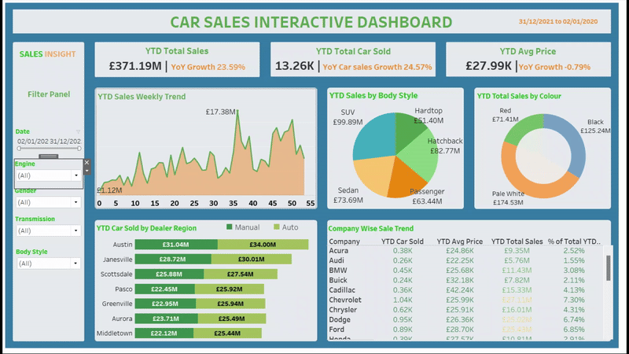
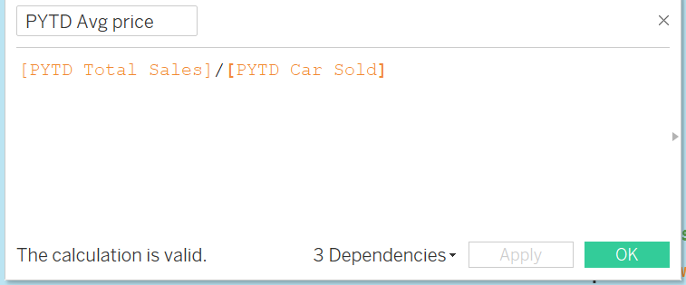
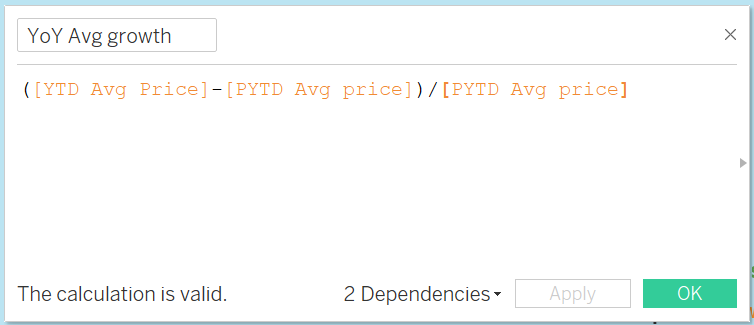
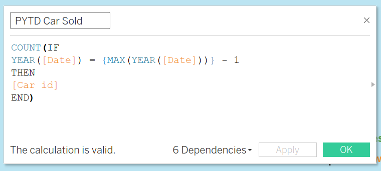
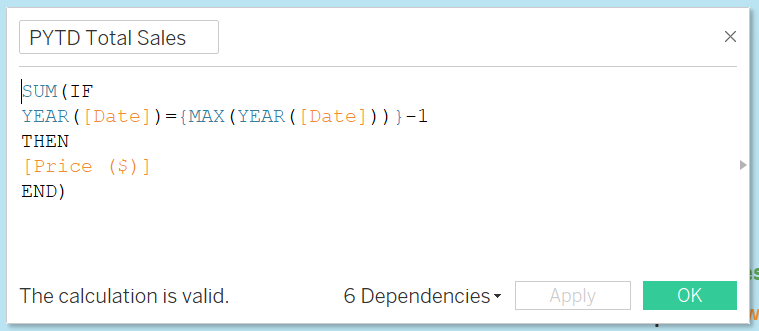
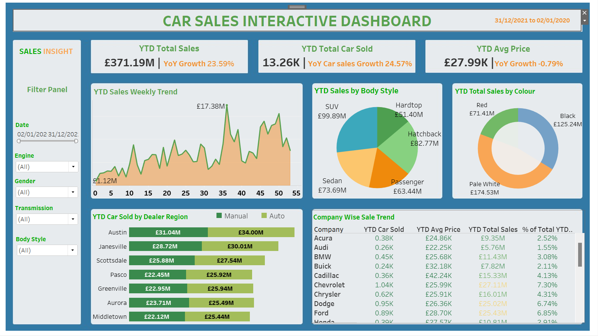
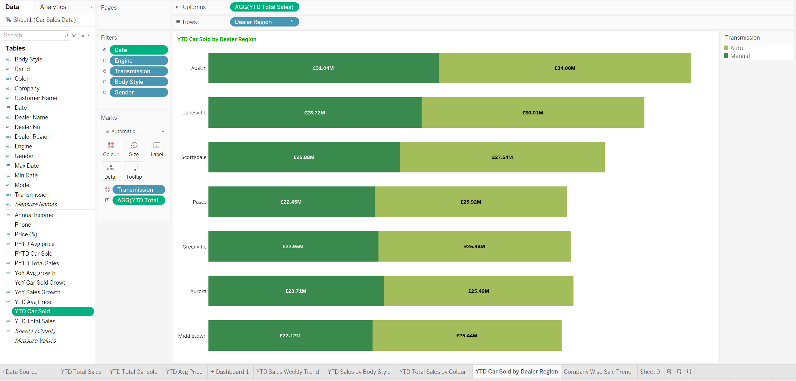
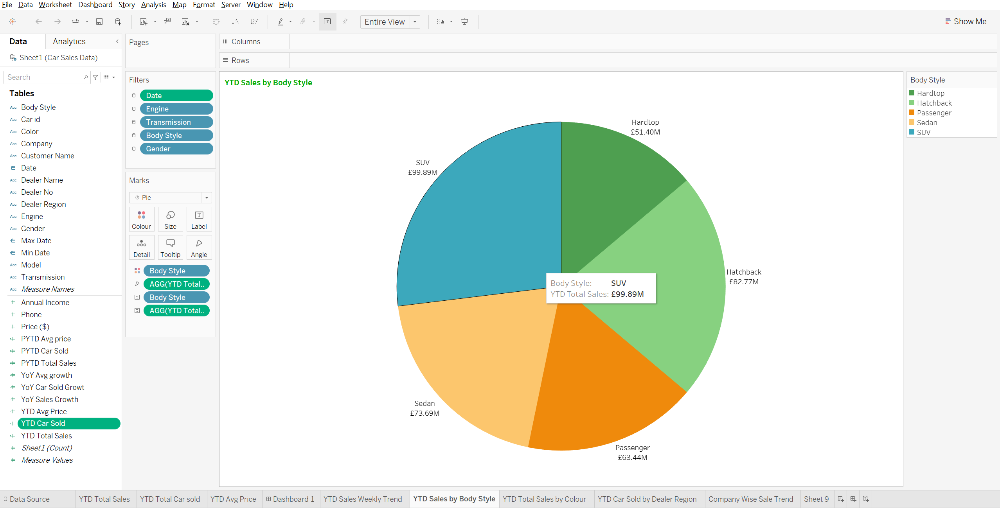
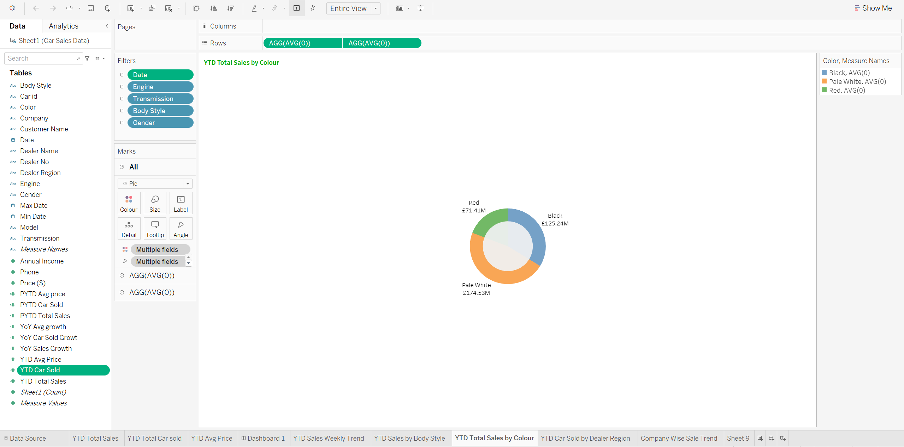
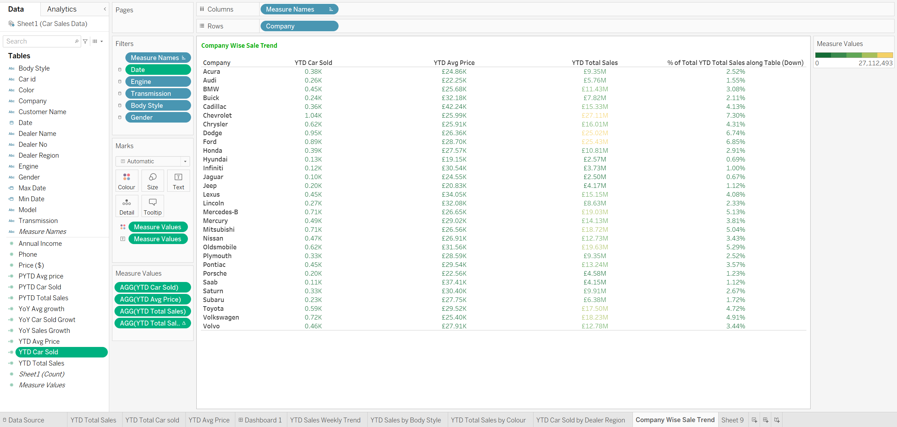

# Car Sales Interactive Dashboard 

## Introduction
This is Tableau project analyzes car sales data. In order to help the stakeholder make data-driven decisions, the project will analyze and extract real time insights to address important questions, monitor progress and identify trends opportunities for growth.

_**Disclaimer:** All datasets and reports are fictitious and are intended only to show off Tableau's capabilities. They do not represent any organization or enterprise._

## Problem Statement
1.	Sales overview?
-	Year to Year (YTD) Total Sales
-	Year over Year (YOY) Growth in Total Sales
2.	Average Price Analysis: 
-	YTD Average Price
-	YOY Growth in Average Price
3.	Cars Sold Metrics
-	Year To Date Cars Sold
-	Year On Year Growth in Cars Sold
4.	YTD Sales weekly trend
5.	YTD total sales by body type
6.	YTD total sales by colour
7.	YTD Car sold by dealer region
8.	Company-wise sales trend in Grid form

## Skills demonstrated

•	Tableau Visualisation

•	Tableau Calculations

•	Power point

Calculations below were created to detailed analysis
  
  PYTD AVG PRICE     |  YOY AVG GROWTH
:-------------------:|:---------------------:
|

  PYTD CAR SOLD      |  PYTD TOTAL SALES
:-------------------:|:---------------------:
|
---

## Data Sourcing 
This dataset was generated online and saved as a CSV file. To do insightful analysis, one must be aware of the dataset's structure.

## Visualization:
The report comprise of one page
1.	Car Sales Interactive Dashboard
You can interact with the report [here](https://public.tableau.com/views/CARSALESINTERACTIVEDASHBOARD/Dashboard1?:language=en-GB&:sid=&:display_count=n&:origin=viz_share_link)

  PYTD CAR SOLD      |  PYTD TOTAL SALES
:-------------------:|:---------------------:
|

  PYTD CAR SOLD      |  PYTD TOTAL SALES
:-------------------:|:---------------------:
|

---
## Findings

